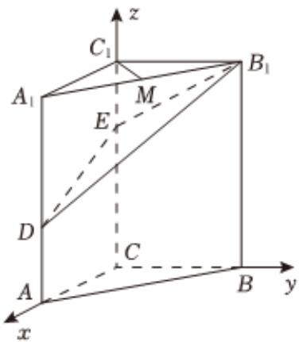

> [!faq]- 2025-2026学年内蒙古包头九中高二（上）段考数学试卷（1月份）解析
>
> > [!success]- **【答案】** 详见解析
>
> > [!note]- **【解析】**
> > 详见解析
> >
> > (1)由 $3a_{1}+3^{2}a_{2}+\cdots+3^{n}a_{n}=n$ ，可得n=1时， $3a_{1}=1$ ，即 $a_{1}=\frac{1}{3}$ ，
> >
> > 当 $n\geqslant2$ 时，由 $3a_{1}+3^{2}a_{2}+\cdots+3^{n}a_{n}=n$ ，
> >
> > 可得 $3a_{1}+3^{2}a_{2}+\cdots+3^{n-1}a_{n-1}=n-1$ ，
> >
> > 两式相减，得 $3^{n}a_{n} = 1$ ，则 $a_{n} = \frac{1}{3^{n}}$
> >
> > 上式对n=1也成立，
> >
> > 所以 $\{a_{n}\}$ 的通项公式是 $a_{n} = \frac{1}{3^{n}}$
> >
> > $$
> > b _ {n} = \left| 1 1 + \log_ {3} a _ {2 n} \right| = \left| 1 1 + \log_ {3} \frac {1}{3 ^ {2 n}} \right| = \left| 1 1 - 2 n \right|
> > $$
> >
> > 令 $11 - 2n \geqslant 0$ ，得 $n \leqslant \frac{11}{2}$ ，则 $n \leqslant 5$ ，记 $c_{n} = 11 - 2n$ 当 $n \leqslant 5$ 时， $b_n = c_n$ ，则 $T_n = \frac{n(c_1 + c_n)}{2} = \frac{n(20 - 2n)}{2} = 10n - n^2$ ；  
> > 当 $n \geqslant 6$ 时， $b_n = -c_n$ ，则 $T_n = (c_1 + c_2 + \dots + c_5) - (c_6 + c_7 + \dots + c_n)$ $= 2(c_1 + c_2 + \dots + c_5) - (c_1 + c_2 + \dots + c_5 + c_6 + c_7 + \dots + c_n) = n^2 - 10n + 50$ ，所以 $T_n = \begin{cases} 10n - n^2, & n \leqslant 5 \\ n^2 - 10n + 50, & n \geqslant 6 \end{cases}$ .
> >
> > 
