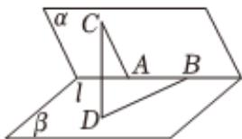

<!-- question-source:start -->
4、如图，二面角 $\alpha - l - \beta$ 的棱上有两个点 $A, B$ ，线段 $BD$ 与 $AC$ 分别在这个二面角两个面内，并且都垂直于棱 $l$ . 若二面角 $\alpha - l - \beta$ 的平面角为 $\frac{\pi}{3}$ ，且 $AB = 4$ ， $AC = 6$ ， $BD = 5$ ，则 $CD =$ \_\_\_\_.

<!-- question-source:end -->

![[Q00092560A1]]
