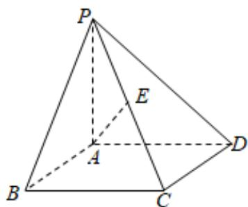

<!-- question-source:start -->
5、

如图，在四棱锥 $P - ABCD$ 中，底面ABCD是正方形， $PA \perp$ 底面ABCD， $E$ 是PC的中点，已知 $AB = 2$ ， $PA = 2$ .

1 求证： $AE \perp PD$ ;

2 求证：平面PBD⊥平面PAC.
<!-- question-source:end -->

![[Q00092565A1]]
