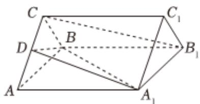

<!-- question-source:start -->
6、如图，三棱柱 $ABC-A_{1}B_{1}C_{1}$ 的底面是边长为2的正三角形，侧棱垂直于底面，侧棱长为 $\sqrt{3}$ ，D为棱AC的中点.

（I）求证： $B_{1}C//$ 平面 $A_{1}BD$ ；

(Ⅱ) 求二面角 $A_{1}-BD-A$ 的大小.

<!-- question-source:end -->

![[Q00092566A1]]
