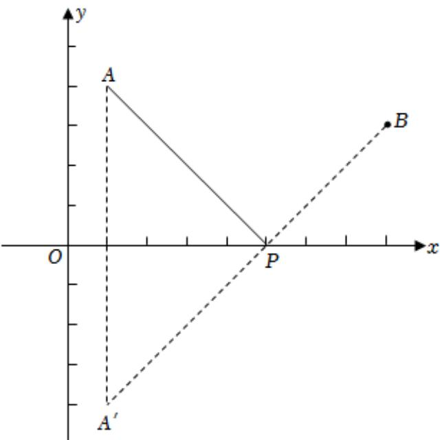

> [!faq]- 2025-2026学年内蒙古包头九十七中高二（上）月考数学试卷（12月份）解析
>
> > [!success]- **【答案】** B
>
> > [!note]- **【解析】**
> > 由题意，点 $A(1,4)$ 关于 $\pmb{x}$ 轴的对称点为 $A^{\prime}(1, - 4)$
> >
> > 连接 $A^{\prime}B$ ，交 $\pmb{x}$ 轴于点 $P$ ，此时 $|AP| + |BP|$ 取得最小
> >
> > 值，如图所示；
> >
> > 设点 $P(x,0)$ ，则 $\overrightarrow{A^{\prime}P}=(x-1,4)$ ，
> >
> > $$
> > \overrightarrow {P B} = (8 - x, 3)
> > $$
> >
> > $A^{\prime}P$ 与 $\overline{PB}$ 共线，则3 $(x - 1) - 4(8 - x) = 0$
> >
> > 解得x = 5
> >
> > 所以点P的坐标是(5,0).
> >
> > 故选：B.
> >
> > 
