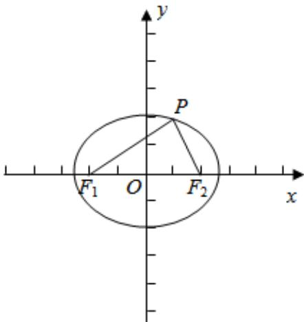

> [!faq]- 2025-2026学年内蒙古包头九十七中高二（上）月考数学试卷（12月份）解析
>
> > [!success]- **【答案】** D
>
> > [!note]- **【解析】**
> > $F_{1}$ ， $F_{2}$ 是椭圆 $C$ 的两个焦点， $P$ 是 $C$ 上的一点，若 $PF_{1} \perp PF_{2}$ ，且 $\angle PF_{2}F_{1} = 60^{\circ}$ ，可得椭圆的焦点坐标 $F_{2}(c,0)$
> >
> > 所以 $P\left(\frac{1}{2} c, \frac{\sqrt{3}}{2} c\right)$ . 可得： $\frac{c^2}{4a^2} + \frac{3c^2}{4b^2} = 1$ ，可得
> >
> > $\frac{1}{4} e^{2} + \frac{3}{4\left(\frac{1}{e^{2}} - 1\right)} = 1$ ，可得 $e^4 -8e^2 +4 = 0$ ， $e\in (0,1)$
> >
> > 解得 $e=\sqrt{3}-1$ .
> >
> > 法二，由题意可得 $\left|PF_{1}\right|=\sqrt{3}c,\left|PF_{2}\right|=c$
> >
> > $$
> > \therefore 2 a = \left| P F _ {1} \right| + \left| P F _ {2} \right| = \sqrt {3} c + c, \therefore \frac {c}{a} = \frac {2}{\sqrt {3} + 1} = \sqrt {3} - 1.
> > $$
> >
> > 故选：D.
> >
> > 
