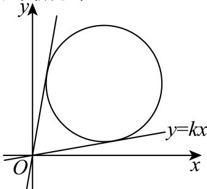

> [!faq]- 2025-2026学年内蒙古包头九十七中高二（上）月考数学试卷（12月份）解析
>
> > [!success]- **【答案】** $3 + 2\sqrt{2}$
>
> > [!note]- **【解析】**
> > 由题意 $(x - 3)^2 +(y - 3)^2 = 6$ 圆的圆心(3,3)，半径为 $\sqrt{6}$ 而 $\frac{y}{x} = \frac{y - 0}{x - 0}$ ，它的几何意义是，圆上的点 $(x,y)$ 与点(0,0)连线的斜率，如图所示，
> >
> > 
> >
> > 显然当直线 $y = kx$ 与圆相切时，切点与原点的连线斜率有最值，即 $k$ 有最值，
> >
> > 当 $y = kx$ 与圆 $(x - 3)^2 +(y - 3)^2 = 6$ 相切时，则 $\frac{|3k - 3|}{\sqrt{1 + k^2}} = \sqrt{6}$ ，解得 $k = 3 \pm 2\sqrt{2}$ ，
> >
> > 所以 $k$ 的最大值为 $3 + 2\sqrt{2}$ ，即 $\frac{y}{x}$ 的最大值为 $3 + 2\sqrt{2}$ ，
> >
> > 故答案为： $3 + 2\sqrt{2}$ .
