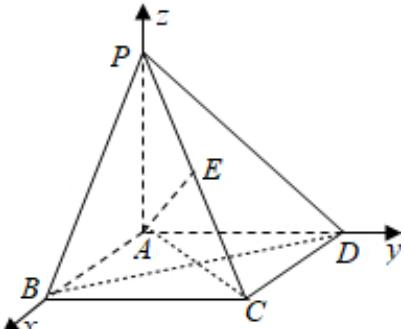

> [!faq]- 2025-2026学年内蒙古包头九十七中高二（上）月考数学试卷（12月份）解析
>
> > [!success]- **【答案】** 详见解析
>
> > [!note]- **【解析】**
> > 详见解析
> >
> > 证明：（Ⅰ）以A为原点，AB，AD，AP所在直线分别为x轴，y轴，z轴，建立空间直角坐标系，则 $B(2,0,0)$ ， $C(2,2,0)$ ， $D(0,2,0)$ ， $P(0,0,2)$ ， $E(1,1,1)$ ∴ $\overrightarrow{AE} = (1, 1, 1)$ ， $\overrightarrow{PD} = (0, 2, -2)$ ∴ $\overrightarrow{AE} \cdot \overrightarrow{PD} = 0$ ，∴ $AE \perp PD$ .
> > （Ⅱ）连接BD，AC，
> >
> > 
> >
> > 由已知得 $BD \perp AC$ ， $BD \perp AP$
> >
> > $\because AC \cap AP = A, \therefore BD \perp$ 平面 $PAC$
> >
> > ∴平面PAC的法向量 $\overrightarrow{BD}=(-2,2,0)$
> >
> > 设平面PBD的法向量 $\overrightarrow{n}=(x,y,z)$ ，
> >
> > $$
> > \overrightarrow {P B} = (2, 0, - 2), \overrightarrow {P D} = (0, 2, - 2)
> > $$
> >
> > $$
> > \left\{ \begin{array}{l} \overrightarrow {n} \cdot \overrightarrow {P B} = 2 x - 2 z = 0 \\ \overrightarrow {n} \cdot \overrightarrow {P D} = 2 y - 2 z = 0 \end{array} \right.
> > $$
> >
> > $$
> > z = 1
> > $$
> >
> > $$
> > \overrightarrow {n} = (1, 1, 1)
> > $$
> >
> > $$
> > \because \overrightarrow {n} \cdot \overrightarrow {B D} = 0
> > $$
> >
> > ∴平面PBD⊥平面PAC.
