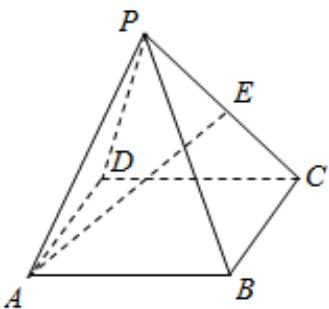

<!-- question-source:start -->
2、四棱锥P-ABCD中，底面ABCD是平行四边形，点E为棱PC的中点，若 $\overrightarrow{AE}=x\overrightarrow{AB}+2y\overrightarrow{BC}+3z\overrightarrow{AP}$ ，则 $x+y+z$ 等于（）

B $\frac{11}{12}$ C $\frac{11}{6}$ D 2
<!-- question-source:end -->

![[Q00091137A1]]
