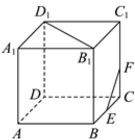

<!-- question-source:start -->
5、直线 $x + 2y - 3 = 0$ 与圆 $(x + 2)^2 +(y - 1)^2 = 5$ 相交于两点 $A,B$ ，则 $|AB| = ()$ A $\frac{3\sqrt{5}}{5}$ B $\frac{8\sqrt{5}}{5}$ C $\frac{6\sqrt{5}}{5}$ D $\frac{4\sqrt{5}}{5}$

<!-- question-source:end -->

![[Q00091140A1]]
