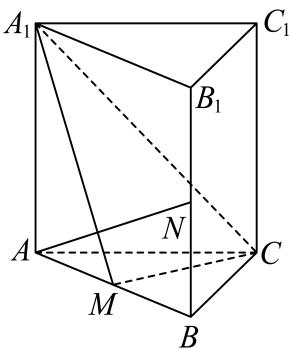

<!-- question-source:start -->
3、如图，棱长均为2的正三棱柱 $ABC-A_{1}B_{1}C_{1}$ 中，M、N分别是AB、 $BB_{1}$ 的中点，则（）
A $B_{1}C_{1}$ //平面 $A_{1}CM$ B $AN \perp A_{1}C$

C 平面 $A_{1}CM \perp$ 平面 $ABB_{1}A_{1}$

D 直线 $A_{1}M$ 与 $B_{1}C_{1}$ 所成角的余弦值为 $\frac{\sqrt{5}}{10}$
<!-- question-source:end -->

![[Q00091146A1]]
