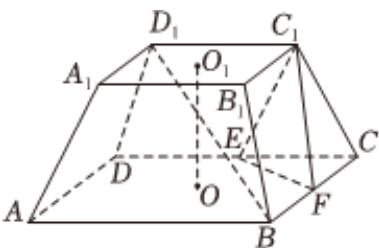

<!-- question-source:start -->
4、在平面直角坐标系 $xOy$ 中，已知 $\triangle ABC$ 的顶点 $A(3,4)$ ， $AB$ 边上中线 $CD$ 所在直线方程为 $2x + 3y - 11 = 0$ ， $AC$ 边上的高 $BH$ 所在直线方程为 $x - 3y + 7 = 0$ ，求：

1 顶点 $C$ 的坐标；

2 求 $\triangle ABC$ 的面积.

如图，四棱台 $ABCD - A_{1}B_{1}C_{1}D_{1}$ 中，上、下底面均是正方形，且侧面是全等的等腰梯形， $AB = 2A_{1}B_{1} = 4$ ， $E$ ， $F$ 分别为 $DC$ ， $BC$ 的中点，上下底面中心的连线 $O_{1}O$ 垂直于上下底面，且 $O_{1}O$ 与侧棱所在直线所成的角为 $45^{\circ}$ .

1 求证： $B_{1}D \parallel$ 平面 $C_{1}EF$ ；

2 求点 $D_{1}$ 到平面 $C_{1}EF$ 的距离；

3

在线段 $BD_{1}$ 上是否存在点M，使得直线 $A_{1}M$ 与平面 $C_{1}EF$ 所成的角为 $45^{\circ}$ ，若存在，求出线段BM的长；若不存在，请说明理由.
<!-- question-source:end -->

![[Q00091153A1]]
