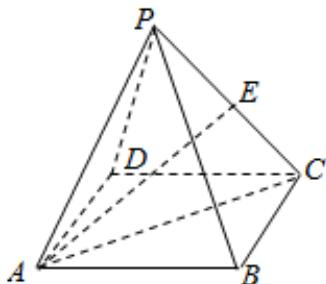

> [!faq]- 2025-2026学年内蒙古包头九十六中高二（上）段考数学试卷解析
>
> > [!success]- **【答案】** B
>
> > [!note]- **【解析】**
> > 如图所示，
> >
> > 
> >
> > 因为底面ABCD是平行四边形，点E为棱PC的中点，
> >
> > 所以 $\overrightarrow{AE} = \frac{1}{2} (\overrightarrow{AP} +\overrightarrow{AC}) = \frac{1}{2}\overrightarrow{AP} +\frac{1}{2} (\overrightarrow{AB} +\overrightarrow{BC}) = \frac{1}{2}\overrightarrow{AB} +\frac{1}{2}\overrightarrow{BC} +\frac{1}{2}\overrightarrow{AP},$
> >
> > 若 $\overrightarrow{AE} = x\overrightarrow{AB} +2y\overrightarrow{BC} +3z\overrightarrow{AP}$ ，则 $\left\{ \begin{array}{l}x = \frac{1}{2}\\ 2y = \frac{1}{2}\\ 3z = \frac{1}{2} \end{array} \right.$
> >
> > 解得 $\left\{ \begin{array}{l} x = \frac{1}{2} \\ y = \frac{1}{4} \\ z = \frac{1}{6} \end{array} \right.$
> >
> > 所以 $x+y+z=\frac{1}{2}+\frac{1}{4}+\frac{1}{6}=\frac{11}{12}.$
> >
> > 故选：B.
