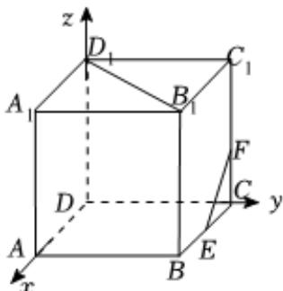

> [!faq]- 2025-2026学年内蒙古包头九十六中高二（上）段考数学试卷解析
>
> > [!success]- **【答案】** C
>
> > [!note]- **【解析】**
> > 如图，
> >
> > 
> >
> > 以 $D$ 为原点，分别以 $DA$ ， $DC$ ， $DD_{1}$ 所在直线为 $\pmb{x}$ ， $\pmb{y}$ ， $z$ 轴，建立空间直角坐标系，
> >
> > 因为正方体的棱长为2，则 $D_{1}(0,0,2)$ ， $B_{1}(2,2,2)$ ， $E(1,2,0)$ ， $F(0,2,\frac{2}{3})$ .
> >
> > 所以 $\overrightarrow{D_1B_1} = (2, 2, 0)$ ，又 $\overrightarrow{EF} = (-1, 0, \frac{2}{3})$
> >
> > 可得 $\overrightarrow{EF} \cdot \overrightarrow{D_1B_1} = -1 \times 2 + 0 \times 2 + \frac{2}{3} \times 0 = -2, |\overrightarrow{D_1B_1}| = \sqrt{2^2 + 2^2 + 0^2} = 2\sqrt{2}$ ,
> >
> > $$
> > | \overrightarrow {E F} | = \sqrt {(- 1) ^ {2} + 0 ^ {2} + (\frac {2}{3}) ^ {2}} = \frac {\sqrt {1 3}}{3}
> > $$
> >
> > 所以cos $< \overrightarrow{EF},\overrightarrow{D_1B_1} > = \frac{\overrightarrow{EF}\bullet\overrightarrow{D_1B_1}}{|\overrightarrow{EF}|\bullet|\overrightarrow{D_1B_1}|} = \frac{-2}{2\sqrt{2}\times\frac{\sqrt{13}}{3}} = -\frac{3\sqrt{26}}{26}.$
> >
> > 设异面直线 $EF$ 与 $B_{1}D_{1}$ 所成的角为 $\theta$ ， $\theta \in [0,\frac{\pi}{2} ]$
> >
> > $$
> > \cos \theta = | \cos <   \overrightarrow {E F}, \overrightarrow {D _ {1} B _ {1}} > | = \frac {3 \sqrt {2 6}}{2 6}.
> > $$
> >
> > 故选：C.
