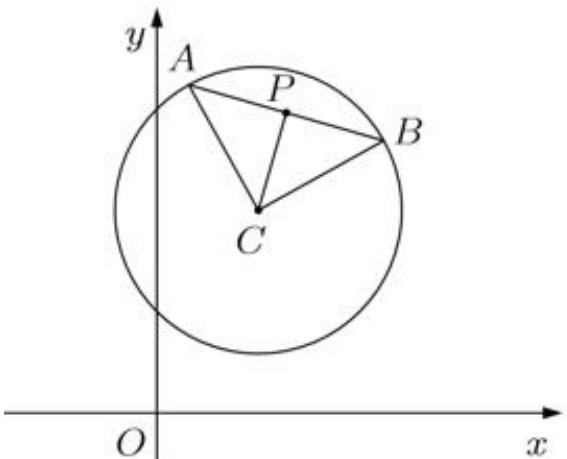

> [!faq]- 2025-2026学年内蒙古包头九十六中高二（上）段考数学试卷解析
>
> > [!success]- **【答案】** B
>
> > [!note]- **【解析】**
> > 圆 $C$ 即 $(x - 1)^2 +(y - 2)^2 = 2$ ，半径 $r = \sqrt{2}$
> >
> > 因为 $CA \perp CB$ ，所以 $AB = \sqrt{2} r = 2$
> >
> > 又P是AB的中点，所以CP= $\frac{1}{2}$ AB=1，
> >
> > 
> >
> > 所以点P的轨迹方程为 $(x-1)^{2}+(y-2)^{2}=1$ ，
> >
> > 故选：B.
