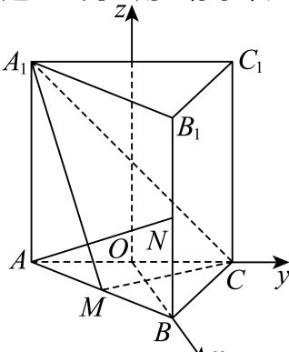

> [!faq]- 2025-2026学年内蒙古包头九十六中高二（上）段考数学试卷解析
>
> > [!success]- **【答案】** BCD
>
> > [!note]- **【解析】**
> > 建立空间直角坐标系，如下图所示：
> >
> > 
> >
> > $$
> > A (0, - 1, 0), B (\sqrt {3}, 0, 0), C (0, 1, 0), A _ {1} (0, - 1, 2)
> > $$
> >
> > $B_{1}(\sqrt{3},0,2),C_{1}(0,1,2),M(\frac{\sqrt{3}}{2}, - \frac{1}{2},0),N(\sqrt{3},0,1),$
> >
> > $$
> > \overrightarrow {| B _ {1} C _ {1}} = (- \sqrt {3}, 1, 0), \overrightarrow {A N} = (\sqrt {3}, 1, 1), \overrightarrow {A _ {1} C} = (0, 2, - 2)
> > $$
> >
> > $$
> > \overrightarrow {A _ {1} M} = \left(\frac {\sqrt {3}}{2}, \frac {1}{2}, - 2\right), \overrightarrow {A _ {1} B _ {1}} = \left(\sqrt {3}, 1, 0\right)
> > $$
> >
> > 设平面 $A_{1}CM$ 的一个法向量为 $\overrightarrow{n}=(x,y,z)$ ,
> >
> > 则 $\left\{ \begin{array}{l} \overrightarrow{n} \cdot \overrightarrow{A_1C} = 0 \\ \overrightarrow{n} \cdot \overrightarrow{A_1M} = 0 \end{array} \right.$ ，即 $\left\{ \begin{array}{l} y - z = 0 \\ \sqrt{3} x + y - 4z = 0 \end{array} \right.$ ，令 $x = 3$ ，可以得到 $\overrightarrow{n} = (3, \sqrt{3}, \sqrt{3})$
> >
> > $A$ 选项， $\overrightarrow{B_1C_1}\cdot \overrightarrow{n} = (-\sqrt{3},1,0)\cdot (3,\sqrt{3},\sqrt{3}) = -2\sqrt{3}\neq 0$ ，故 $B_{1}C_{1}$ 与面 $A_{1}CM$ 不平行，故 $A$ 错误；
> >
> > $$
> > \overrightarrow {A N} \cdot \overrightarrow {A _ {1} C} = (\sqrt {3}, 1, 1) \cdot (0, 2, - 2) = 0
> > $$
> >
> > $$
> > A N \bot A _ {1} C
> > $$
> >
> > $C$ 选项， $\overrightarrow{MC} = (-\frac{\sqrt{3}}{2},\frac{3}{2},0),\overrightarrow{AB} = (\sqrt{3},1,0),\overrightarrow{AA_1} = (0,0,2)$
> >
> > 则 $\overrightarrow{MC} \cdot \overrightarrow{AB} = -\frac{3}{2} + \frac{3}{2} + 0 = 0, \overrightarrow{MC} \cdot \overrightarrow{AA_1} = 0$ ，所以 $MC \perp AB, MC \perp AA_1$
> >
> > 又 $AB \cap AA_{1} = A$ , $AB$ , $AA_{1} \subset$ 面 $ABB_{1}A_{1}$ , 故 $MC \perp$ 面 $ABB_{1}A_{1}$
> >
> > 所以 $\overrightarrow{MC} = (-\frac{\sqrt{3}}{2},\frac{3}{2},0)$ 为平面 $ABB_{1}A_{1}$ 的法向量，
> >
> > 又 $\overrightarrow{MC} \cdot \overrightarrow{n} = -\frac{3\sqrt{3}}{2} + \frac{3\sqrt{3}}{2} + 0 = 0$ ，所以面 $A_{1}CM$ 上面 $ABB_{1}A_{1}$ ，故 $C$ 正确；
> >
> > $D$ 选项， $\overrightarrow{B_1C_1} = (-\sqrt{3},1,0),\overrightarrow{A_1M} = (\frac{\sqrt{3}}{2},\frac{1}{2}, - 2)$
> >
> > 设直线 $A_{1}M$ 与 $B_{1}C_{1}$ 所成的角为 $\theta$ ，
> >
> > $$
> > | c o s \theta = | c o s \langle \overrightarrow {A _ {1} M}, \overrightarrow {B _ {1} C _ {1}} \rangle | = | \frac {(\frac {\sqrt {3}}{2} , \frac {1}{2} , - 2) \cdot (- \sqrt {3} , 1 , 0)}{\sqrt {5} \times 2} | = \frac {\sqrt {5}}{1 0}
> > $$
> >
> > 所以直线 $A_{1}M$ 与 $B_{1}C_{1}$ 所成角的余弦值为 $\frac{\sqrt{5}}{10}$ ，故 $D$ 正确.
> >
> > 故选：BCD.
