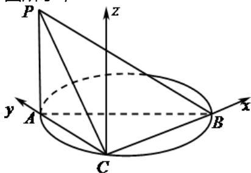

> [!faq]- 2025-2026学年内蒙古包头九十六中高二（上）段考数学试卷解析
>
> > [!success]- **【答案】** 详见解析
>
> > [!note]- **【解析】**
> > 详见解析
> >
> > (1)证明：因为AB是圆的直径，C在圆上，所以BC⊥AC，
> >
> > 又平面 $PAC \perp$ 平面ACB，且平面PAC与平面ACB相交于AC。
> >
> > $AP \subset$ 平面 $PAC$ ，且 $AP \perp AC$ ，所以 $PA \perp$ 平面 $ACB$
> >
> > 又 $BC \subset$ 平面ACB，所以 $BC \perp PA$ ，
> >
> > 又 $AC \subset$ 平面 $PAC, PA \subset$ 平面 $PAC$ , 且 $AC$ 与 $PA$ 相交于点 $A$ ,
> >
> > 所以 $BC \perp$ 平面PAC.
> >
> > (2)由(1)可得， $BC \perp AC$ ， $BC \perp PA$ ， $AC \perp PA$ ，
> >
> > 以 $C$ 为原点，以直线 $CB$ 为 $\mathbf{x}$ 轴，以直线 $CA$ 为 $\mathbf{y}$ 轴，过 $C$ 平行于 $PA$ 的直线为 $z$ 轴，建立空间直角坐标系，如图所示，
> >
> > 
> >
> > 因为 $AB = 2$ ， $AC = 1$ ， $BC \perp AC$ ，所以 $BC = \sqrt{AB^2 - AC^2} = \sqrt{4 - 1} = \sqrt{3}$
> >
> > 所以 $C(0,0,0),A(0,1,0),B(\sqrt{3},0,0),P(0,1,1)$
> >
> > 则 $\overrightarrow{CB} = (\sqrt{3}, 0, 0), \overrightarrow{AP} = (0, 0, 1), \overrightarrow{CP} = (0, 1, 1)$
> >
> > 设平面PBC的法向量为 $\overrightarrow{n}=\left(x_{1},y_{1},z_{1}\right)$ ,
> >
> > 则 $\left\{ \begin{array}{l} \overrightarrow{n} \perp \overrightarrow{CB} \\ \overrightarrow{n} \perp \overrightarrow{CP} \end{array} \right.$ ，则 $\left\{ \begin{array}{l} \overrightarrow{n} \cdot \overrightarrow{CB} = 0 \\ \overrightarrow{n} \cdot \overrightarrow{CP} = 0 \end{array} \right.$ ，即 $\left\{ \begin{array}{l} \sqrt{3} x_1 = 0 \\ y_1 + z_1 = 0 \end{array} \right.$
> >
> > 令 $y_{1}=1$ ，解得 $x_{1}=0$ ， $z_{1}=-1$ ，所以 $\overrightarrow{n}=(0,1,-1)$ ，
> >
> > 又 $PA \perp$ 平面ABC，所以平面ABC的法向量为 $\overrightarrow{AP} = (0, 0, 1)$ ，
> >
> > 设平面ABC与平面PBC所成角为 $\theta(0<\theta\leqslant\frac{\pi}{2}]$ ，
> >
> > $$
> > \cos \theta = \frac {| \overrightarrow {A P} \cdot \overrightarrow {n} |}{| \overrightarrow {A P} | \cdot | \overrightarrow {n} |} = \frac {| 0 \times 0 + 0 \times 1 + 1 \times (- 1) |}{\sqrt {0 ^ {2} + 0 ^ {2} + 1 ^ {2}} \cdot \sqrt {0 ^ {2} + 1 ^ {2} + (- 1) ^ {2}}} = \frac {\sqrt {2}}{2},
> > $$
> >
> > 所以平面ABC与平面PBC所成角的余弦值为 $\frac{\sqrt{2}}{2}$ .
