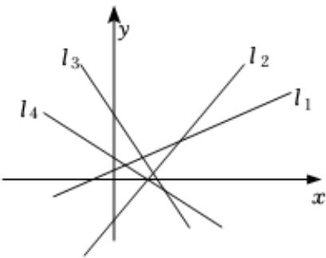

<!-- question-source:start -->
5、如图，设直线 $l_{1}$ ， $l_{2}$ ， $l_{3}$ ， $l_{4}$ 的斜率分别为 $k_{1}$ ， $k_{2}$ ， $k_{3}$ ， $k_{4}$ ，则用“<”号将它们的斜率 $k_{1}$ ， $k_{2}$ ， $k_{3}$ ， $k_{4}$ 连接起来后，得到的结果为（）

A $k_{1} < k_{2} < k_{3} < k_{4}$ B $k_{2} < k_{1} < k_{3} < k_{4}$ C $k_{4} < k_{3} < k_{1} < k_{2}$ D $k_{3} < k_{4} < k_{1} < k_{2}$

<!-- question-source:end -->

![[Q00092017A1]]
