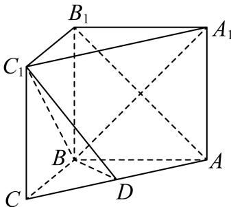

<!-- question-source:start -->
4、如图，在直三棱柱 $ABC-A_{1}B_{1}C_{1}$ 中， $\angle ABC=\frac{\pi}{2}$ ，D是棱AC的中点，AB=BC=BB $_{1}$ =2.

1 求 $C$ 点到平面 $BDC_{1}$ 的距离.

2 求直线 $A_{1}B$ 与平面 $BDC_{1}$ 所成的角的正弦值.
<!-- question-source:end -->

![[Q00092569A1]]
