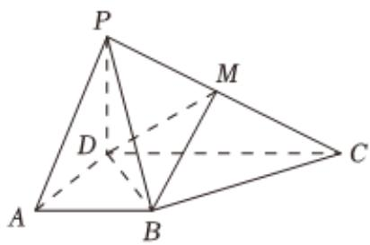

<!-- question-source:start -->
5、

如图，在四棱锥P-ABCD中，平面 $PDC \perp$ 平面
ABCD, PD⊥DC, AD⊥DC, AB∥DC,
AD = PD = AB = $\frac{1}{2}$ CD = 1, M为棱PC的中点.

1 证明：BM//平面PAD；

2 求平面PDM和平面BDM的夹角的余弦值；

3

在线段 $PA$ 上是否存在点 $Q$ ，使点 $Q$ 到平面 $BDM$ 的距离是 $\frac{2\sqrt{6}}{9}$ ？若存在，求 $PQ$ 的长；若不存在，说明理由.
<!-- question-source:end -->

![[Q00092570A1]]
