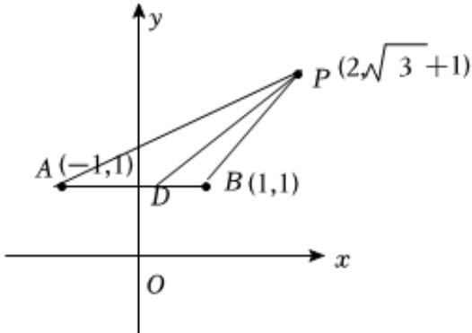

> [!faq]- 2025-2026学年内蒙古包头九十六中高二（上）第一次月考数学试卷解析
>
> > [!success]- **【答案】** $\left[\frac{\sqrt{3}}{3},\sqrt{3}\right]$
>
> > [!note]- **【解析】**
> > 如图所示：
> >
> > 
> >
> > 因为点D是△ABC边AB上的一动点，
> >
> > 所以直线 $CD$ 的斜率 $\pmb{k}$ 满足 $\pmb{k}_{CA} \leqslant \pmb{k} \leqslant \pmb{k}_{CB}$ ; 又因为 $\pmb{k}_{CA} = \frac{(\sqrt{3} + 1) - 1}{2 - (-1)} = \frac{\sqrt{3}}{3}$ ,
> >
> > $$
> > k _ {C B} = \frac {(\sqrt {3} + 1) - 1}{2 - 1} = \sqrt {3},
> > $$
> >
> > 所以 $\frac{\sqrt{3}}{3} \leqslant k \leqslant \sqrt{3}$ ;
> >
> > 所以 $k$ 的范围是 $\left[\frac{\sqrt{3}}{3},\sqrt{3}\right]$
> >
> > 故答案为： $\left[\frac{\sqrt{3}}{3},\sqrt{3}\right]$ .
