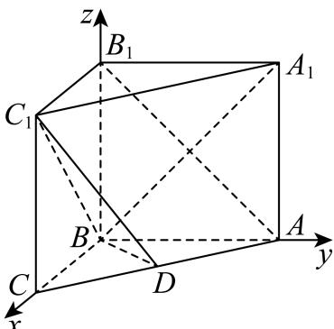

> [!faq]- 2025-2026学年内蒙古包头九十六中高二（上）第一次月考数学试卷解析
>
> > [!success]- **【答案】** 详见解析
>
> > [!note]- **【解析】**
> > 详见解析
> >
> > (1)由题意可知，BA，BC，BB $_{1}$ 两两垂直，于是建立如图所示的空间直角坐标系B-xyz， 则 $B(0,0,0),A_{1}(0,2,2),C_{1}(2,0,2),D(1,1,0),C(2,0,0)$
> >
> > 
> >
> > $$
> > \overrightarrow {B C} _ {1} = (2, 0, 2), \overrightarrow {B D} = (1, 1, 0), \overrightarrow {C C _ {1}} = (0, 0, 2)
> > $$
> >
> > 设平面 $BDC_{1}$ 的一个法向量为 $\overrightarrow{n} = (x, y, z)$ ,
> >
> > 则 $\left\{\begin{aligned}\overrightarrow{n}\perp\overrightarrow{BD}\\ \overrightarrow{n}\perp\overrightarrow{BC_{1}}\end{aligned}\right.$ ，则 $\left\{\begin{aligned}\overrightarrow{n}\cdot\overrightarrow{BD}=0\\ \overrightarrow{n}\cdot\overrightarrow{BC_{1}}=0\end{aligned}\right.$ ，即 $\left\{\begin{aligned}x+y=0\\ 2x+2z=0\end{aligned}\right.$
> >
> > 令x=-1，则 $\overrightarrow{n}=(-1,1,1)$ .
> >
> > 所以点 $C$ 到平面 $BDC_{1}$ 的距离 $\pmb{d} = \frac{|\overrightarrow{CC_1}\cdot\overrightarrow{n}|}{|\overrightarrow{n}|} = \frac{2}{\sqrt{3}} = \frac{2\sqrt{3}}{3}.$
> >
> > (2)设直线 $A_{1}B$ 与平面 $BDC_{1}$ 所成的角为 $\theta$ ，
> >
> > $$
> > \overrightarrow {B A _ {1}} = (0, 2, 2)
> > $$
> >
> > $$
> > \sin \theta = | \cos <   \overrightarrow {n}, \overrightarrow {B A _ {1}} > | = \frac {| \overrightarrow {B A _ {1}} \cdot \overrightarrow {n} |}{| \overrightarrow {B A _ {1}} | \cdot | \overrightarrow {n} |} = \frac {| 0 + 2 + 2 |}{2 \sqrt {2} \times \sqrt {3}} = \frac {\sqrt {6}}{3},
> > $$
> >
> > 所以直线 $A_{1}B$ 与平面 $BDC_{1}$ 所成的角的正弦值为 $\frac{\sqrt{6}}{3}$ .
