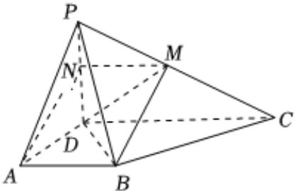
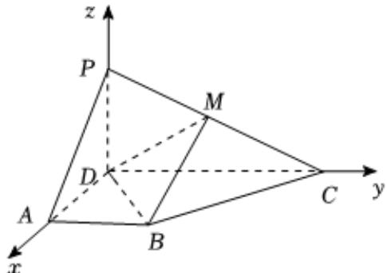

> [!faq]- 2025-2026学年内蒙古包头九十六中高二（上）第一次月考数学试卷解析
>
> > [!success]- **【答案】** 详见解析
>
> > [!note]- **【解析】**
> > 详见解析
> >
> > （1）证明：取 $PD$ 的中点 $N$ ，连接 $AN$ ， $MN$ ，如图所示：
> >
> > 
> >
> > ∵ M 为棱 PC 的中点, ∴ $MN \parallel CD$ , $MN = \frac{1}{2} CD$ ,
> >
> > $\because AB \parallel CD, AB = \frac{1}{2} CD, \therefore AB \parallel MN, AB = MN,$
> >
> > ∴四边形ABMN是平行四边形，∴BM//AN
> >
> > 又BM∉平面PAD，MN⊂平面PAD，∴ BM // 平面 PAD；
> > (2) ∵ 平面 PDC ⊥ 平面 ABCD，平面 PDC ∩ 平面 ABCD = DC，
> > PD ⊂ 平面 PDC，PD ⊥ DC，
> > ∴ PD ⊥ 平面 ABCD，又 AD，CD ⊂ 平面 ABCD，
> > ∴ PD ⊥ AD，而 PD ⊥ CD，AD ⊥ DC，
> > ∴ 以点 D 为坐标原点，DA，DC，DP 所在直线分别为 x，y，z 轴，
> > 建立空间直角坐标系，如图：
> >
> > 
> >
> > $$
> > P (0, 0, 1), D (0, 0, 0), A (1, 0, 0), C (0, 2, 0)
> > $$
> >
> > $\because M$ 为棱 $PC$ 的中点， $\therefore M(0,1,\frac{1}{2})$ ， $B(1,1,0)$
> >
> > $$
> > \overrightarrow {D M} = (0, 1, \frac {1}{2}), \overrightarrow {D B} = (1, 1, 0)
> > $$
> >
> > 设平面BDM的一个法向量为 $\overrightarrow{n}=(x,y,z)$ ,
> >
> > $$
> > \left\{ \begin{array}{l} \overrightarrow {n} \bullet \overrightarrow {D M} = y + \frac {1}{2} z = 0 \\ \overrightarrow {n} \bullet \overrightarrow {D B} = x + y = 0 \end{array} \right.
> > $$
> >
> > $$
> > \therefore \overrightarrow {n} = (1, - 1, 2)
> > $$
> >
> > $$
> > \overrightarrow {D A} = \left(\mathbf {1}, \mathbf {0}, \mathbf {0}\right)
> > $$
> >
> > $$
> > | \cos <   \overrightarrow {n}, \overrightarrow {D A} > = \frac {\overrightarrow {n} \bullet \overrightarrow {D A}}{| \overrightarrow {n} | | \overrightarrow {D A} |} = \frac {1}{1 \times \sqrt {6}} = \frac {\sqrt {6}}{6}
> > $$
> >
> > ∴平面PDM与平面DMB夹角的余弦值为 $\frac{\sqrt{6}}{6}$ ;
> >
> > (3)假设在线段 $PA$ 上存在点 $Q$ ，使得点 $Q$ 到平面 $BDM$ 的距离是 $\frac{2\sqrt{6}}{9}$ 设 $\overrightarrow{PQ} = \lambda \overrightarrow{PA} = \lambda (1,0, - 1) = (\lambda ,0, - \lambda),0 <   \lambda <  1,$ 则 $Q(\lambda ,0,1 - \lambda),\overrightarrow{BQ} = (\lambda -1, - 1,1 - \lambda)$ ，由（2）知平面 $BDM$ 的一个法向量为 $\overrightarrow{n} = (1, - 1,2)$ ，则 $\overrightarrow{BQ}\bullet \overrightarrow{n} = \lambda -1 + 1 + 2(1 - \lambda) = 2 - \lambda$ ， $\therefore$ 点 $Q$ 到平面 $BDM$ 的距离是 $\frac{|\overrightarrow{BQ}\bullet\overrightarrow{n}|}{|\overrightarrow{n}|} = \frac{2 - \lambda}{\sqrt{6}} = \frac{2\sqrt{6}}{9},$
> >
> > $$
> > \therefore \lambda = \frac {2}{3}  ,   \text {故} \overrightarrow {P Q} = \left(\frac {2}{3}  ,   0  ,   - \frac {2}{3}\right)  ,
> > $$
> >
> > 则 $PQ=\frac{2\sqrt{2}}{3}.$
