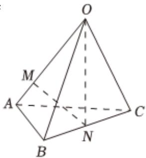

<!-- question-source:start -->
6、在四面体O-ABC中，点M为线段OA靠近A的四等分点，N为BC的中点，若 $\overrightarrow{MN}=x\overrightarrow{OA}+y\overrightarrow{OB}+z\overrightarrow{OC}$ ，则 $x+y+z$ 的值为（）
A $\frac{3}{2}$ B 1
C $\frac{1}{4}$ D $\frac{1}{3}$

<!-- question-source:end -->

![[Q00091159A1]]
