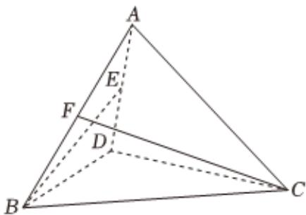

<!-- question-source:start -->
8、如图，在四面体ABCD中，△ADB与△ADC为等边三角形，且BD⊥DC，E，F分别为棱AD，AB的中点，则异面直线BE，CF所成角的余弦值为（）
A $\frac{\sqrt{15}}{6}$ B $\frac{\sqrt{15}}{3}$ C $\frac{\sqrt{5}}{6}$

D $\frac{\sqrt{5}}{3}$
<!-- question-source:end -->

![[Q00091161A1]]
