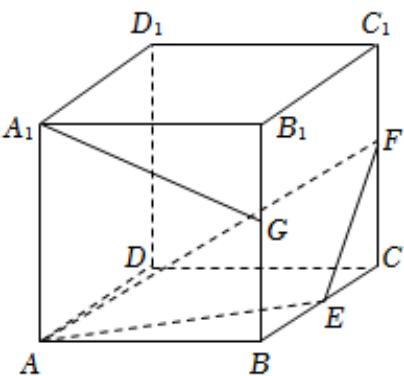

<!-- question-source:start -->
3、在棱长为2的正方体 $ABCD-A_{1}B_{1}C_{1}D_{1}$ 中，E、F、G分别为BC、 $CC_{1}$ 、 $BB_{1}$ 的中点，则下列选项正确的是（）

A $D_{1}D\bot AF$ B 直线 $A_{1}G$ 与 $EF$ 所成角的余弦值为 $\frac{\sqrt{10}}{10}$ C 三棱锥 $G - AEF$ 的体积为 $\frac{1}{3}$ D 存在实数 $\lambda ,\mu$ 使得 $\overrightarrow{A_1G} = \lambda \overrightarrow{AF} +\mu \overrightarrow{AE}$
<!-- question-source:end -->

![[Q00091164A1]]
