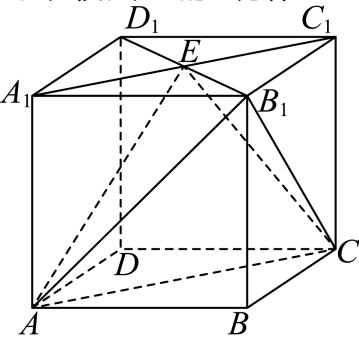

<!-- question-source:start -->
3、在棱长为2的正方体 $ABCD - A_{1}B_{1}C_{1}D_{1}$ 中， $E$ 为 $A_{1}C_{1}$ 的中点.

1 求异面直线 $AE$ 与 $B_{1}C$ 所成角的余弦值；

2 求直线 $DD_{1}$ 与平面 $B_{1}CE$ 所成角的正弦值；

3 求点A到平面 $B_{1}CE$ 的距离.
<!-- question-source:end -->

![[Q00091170A1]]
