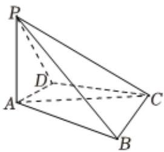

<!-- question-source:start -->
4、已知直线 $l:(a-1)y=(2a-3)x+1.$

1 求直线l所过定点；

2 若直线 $l$ 不经过第四象限，求实数 $\pmb{a}$ 的取值范围；

3 若直线 l 与两坐标轴的正半轴围成的三角形面积最小，求 l 的方程.

如图，四棱锥P-ABCD中，PA⊥底面ABCD，PA=AC=2，BC=1， $AB=\sqrt{3}$ .

1 若 $AD \perp PB$ ，证明： $AD \parallel$ 平面 $PBC$ ；

2 若 $AD \perp DC$ ，且二面角 $A - CP - D$ 的正弦值为 $\frac{\sqrt{42}}{7}$ ，求 $AD$ .
<!-- question-source:end -->

![[Q00091171A1]]
