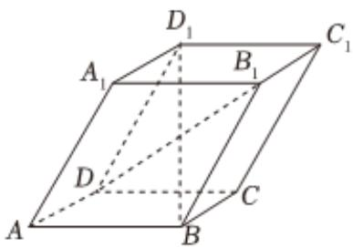

<!-- question-source:start -->
2. 如图所示，四棱柱 $ABCD - A_{1}B_{1}C_{1}D_{1}$ 中，底面为平行四边形，以顶点 $\mathbf{A}$ 为端点的三条棱长都为1，且两两夹角为 $60^{\circ}$ . 设 $\overrightarrow{AB} = \overrightarrow{a}$ ， $\overrightarrow{AD} = \overrightarrow{b}$ ， $\overrightarrow{AA_{1}} = \overrightarrow{c}$ .

1 用 $\{\overrightarrow{a},\overrightarrow{b},\overrightarrow{c}\}$ 为基底表示向量 $\overrightarrow{BD_1}$ ，并求 $BD_{1}$ 的长；

2 求 $\cos\langle\overrightarrow{BD_{1}},\overrightarrow{AC}\rangle$ 的值.
<!-- question-source:end -->

![[Q00092578A1]]
