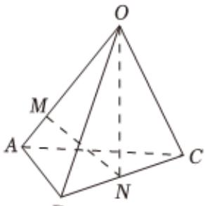

> [!faq]- 2025-2026学年内蒙古包头市包景泰高级中学高二（上）期中数学试卷解析
>
> > [!success]- **【答案】** C
>
> > [!note]- **【解析】**
> > 
> >
> > 由 $\overrightarrow{MN} = \overrightarrow{MA} +\overrightarrow{AN} = \frac{1}{4}\overrightarrow{OA} +\frac{1}{2} (\overrightarrow{AB} +\overrightarrow{AC}) = \frac{1}{4}\overrightarrow{OA} +\frac{1}{2} (\overrightarrow{OB} -\overrightarrow{OA}) + \frac{1}{2} (\overrightarrow{OC} -\overrightarrow{OA})$ $= -\frac{3}{4}\overrightarrow{OA} +\frac{1}{2}\overrightarrow{OB} +\frac{1}{2}\overrightarrow{OC},$ 则 $\left\{ \begin{array}{l}x = -\frac{3}{4}\\ y = \frac{1}{2}\\ z = \frac{1}{2} \end{array} \right.$ 所以 $x + y + z = \frac{1}{4}$ 故选： $C$
