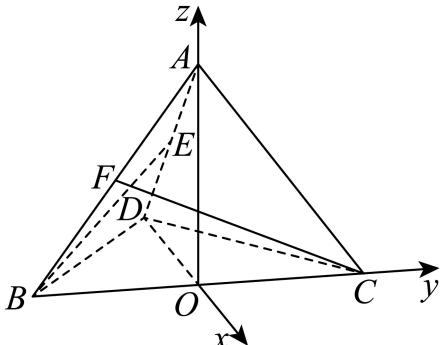

> [!faq]- 2025-2026学年内蒙古包头市包景泰高级中学高二（上）期中数学试卷解析
>
> > [!success]- **【答案】** A
>
> > [!note]- **【解析】**
> > 如图，作 $AO \perp$ 平面BCD于点O，
> >
> > 因为 $AB = AC = AD$ ，则 $O$ 为 $\triangle BCD$ 的外心，
> >
> > 又 $BD \perp DC$ ，BD = DC，故点O为斜边BC的中点，且 $DO \perp BC$ .
> >
> > 故可以点O为原点，分别以DO，OC，OA所在直线为x，y，z轴建立空间直角坐标系，如图.
> >
> > 
> >
> > 设 $BD = DC = 4$ ，则 $BC = 4\sqrt{2}$ ，则 $OD = OB = OC = 2\sqrt{2}$
> >
> > $$
> > O A = \sqrt {A D ^ {2} - D O ^ {2}} = 2 \sqrt {2},
> > $$
> >
> > 则有 $A(0, 0, 2\sqrt{2})$ ， $B(0, -2\sqrt{2}, 0)$ ， $C(0, 2\sqrt{2}, 0)$ ， $D(-2\sqrt{2}, 0, 0)$
> >
> > 因为E，F分别为棱AD，AB的中点，
> >
> > 所以 $E(-\sqrt{2}, 0, \sqrt{2})$ ， $F(0, -\sqrt{2}, \sqrt{2})$
> >
> > 则 $\overrightarrow{CF} = (0, -3\sqrt{2}, \sqrt{2})$ ， $\overrightarrow{BE} = (-\sqrt{2}, 2\sqrt{2}, \sqrt{2})$
> >
> > 设直线BE，CF所成的角为 $\theta$ ，
> >
> > $$
> > | c o s \theta = | c o s \langle \overrightarrow {B E}, \overrightarrow {C F} \rangle | = \frac {| \overrightarrow {B E} \bullet \overrightarrow {C F} |}{| \overrightarrow {B E} | \bullet | \overrightarrow {C F} |} = \frac {1 0}{2 \sqrt {3} \times 2 \sqrt {5}} = \frac {\sqrt {1 5}}{6}.
> > $$
> >
> > 故选：A.
