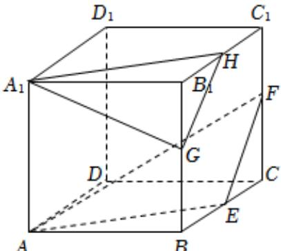
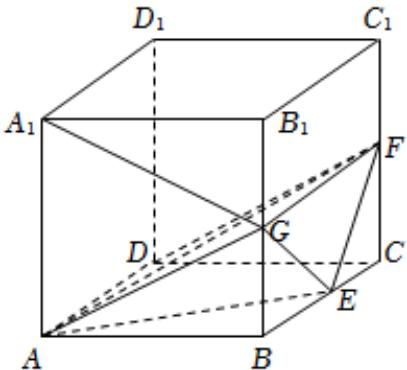
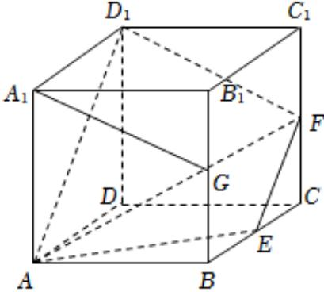

> [!faq]- 2025-2026学年内蒙古包头市包景泰高级中学高二（上）期中数学试卷解析
>
> > [!success]- **【答案】** BD
>
> > [!note]- **【解析】**
> > 对于 $A$ ，在正方体 $ABCD - A_{1}B_{1}C_{1}D_{1}$ 中， $DD_{1} / / AA_{1}$ ，易知 $AA_{1}$ 与 $AF$ 不垂直，
> >
> > $$
> > D _ {1} D.
> > $$
> >
> > 对于 $B$ ，在正方体 $ABCD - A_{1}B_{1}C_{1}D_{1}$ 中，取 $B_{1}C_{1}$ 的中点 $H$ ，连接 $A_{1}H$ ， $GH$ ，如下图，
> >
> > 
> >
> > 易知 $GH \parallel EF$ ，则 $\angle A_{1}GH$ 为直线 $A_{1}G$ 与 EF 夹角或其补角，
> >
> > $$
> > \because A B = 2, \therefore G H = E F = \sqrt {2}, A _ {1} H = A _ {1} G = \sqrt {5}
> > $$
> >
> > 在 $\triangle A_{1}GH$ 中， $cos\angle A_{1}GH = \frac{A_{1}G^{2} + GH^{2} - A_{1}H^{2}}{2\bullet A_{1}G\bullet GH} = \frac{\sqrt{10}}{10}$
> >
> > 因此，直线 $A_{1}G$ 与 $EF$ 所成角的余弦值为 $\frac{\sqrt{10}}{10}$ ，故正确；
> >
> > 对于 $\pmb{C}$ ，根据题意作图如下：
> >
> > 
> >
> > 易知三棱柱 $ABG - DCF$ 的体积 $V_{1} = \frac{1}{4}\times 2\times 2\times 2 = 2$
> >
> > 三棱锥 $G - ABE$ 的体积 $V_{2} = \frac{1}{3}\bullet S_{\triangle ABE}\bullet GB = \frac{1}{3}\bullet \frac{1}{2}\bullet AB\bullet BE\bullet GB = \frac{1}{3},$
> >
> > 四棱锥 $F - AECD$ 的体积 $V_{3} = \frac{1}{3}\bullet S_{AECD}\bullet FC = \frac{1}{3}\bullet (S_{ABCD} - S_{ABE})\bullet FC = 1$
> >
> > 三棱锥 $G - AEF$ 的体积 $V = V_{1} - V_{2} - V_{3} = \frac{2}{3}$ ，故错误；
> >
> > 对于 $D$ ，连接 $D_{1}F$ ， $D_{1}A$ ，作图如下：
> >
> > 
> >
> > 易知 $AD_{1} \parallel EF$ ，则A，E，F， $D_{1}$ 共面， $\because A_{1}G \parallel D_{1}F$ ，则 $\overrightarrow{A_{1}G}$ ， $\overrightarrow{AF}$ ， $\overrightarrow{AE}$ 共面，
> >
> > 即存在实数 $\lambda$ 、 $\mu$ 使得 $\overrightarrow{A_1G} = \lambda \overrightarrow{AF} +\mu \overrightarrow{AE}$ ，故正确；
> >
> > 故选：BD.
