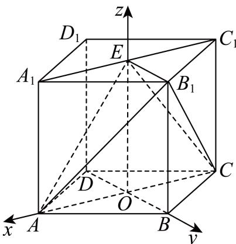

> [!faq]- 2025-2026学年内蒙古包头市包景泰高级中学高二（上）期中数学试卷解析
>
> > [!success]- **【答案】** 详见解析
>
> > [!note]- **【解析】**
> > 详见解析
> >
> > （1）如图，正方体 $ABCD - A_{1}B_{1}C_{1}D_{1}$ 中， $\pmb{E}$ 为 $A_{1}C_{1}$ 的中点，连接BD交AC于O，连接EO，
> >
> > 
> >
> > 根据正方体的性质，知道EO垂直于上下底面，且BO⊥AC
> >
> > 则BO，AC，EO两两垂直，
> >
> > 则可以 $OA$ 为 $\pmb{x}$ 轴， $OB$ 为 $\pmb{y}$ 轴， $OE$ 为 $z$ 轴，建立空间直角坐标系，
> >
> > 由于棱长为2，则面对角线为 $2\sqrt{2}$ ，
> >
> > $$
> > A (\sqrt {2}, 0, 0), E (0, 0, 2), B _ {1} (0, \sqrt {2}, 2), C (- \sqrt {2}, 0, 0)
> > $$
> >
> > 则 $\overrightarrow{AE} = (-\sqrt{2}, 0, 2), \overrightarrow{B_1C} = (-\sqrt{2}, -\sqrt{2}, -2)$
> >
> > $$
> > | c o s \langle \overrightarrow {A E}, \overrightarrow {B _ {1} C} \rangle = \frac {\overrightarrow {A E} \bullet \overrightarrow {B _ {1} C}}{| \overrightarrow {A E} | \bullet | \overrightarrow {B _ {1} C} |} = \frac {- 2}{\sqrt {6} \times \sqrt {8}} = - \frac {\sqrt {3}}{6}
> > $$
> >
> > 则异面直线 $AE$ 与 $B_{1}C$ 所成角的余弦值为 $\frac{\sqrt{3}}{6}$
> >
> > (2)由（1）知 $\overrightarrow{DD_1} = (0, 0, 2)$ ， $\overrightarrow{B_1C} = (-\sqrt{2}, -\sqrt{2}, -2)$ ， $\overrightarrow{CE} = (\sqrt{2}, 0, 2)$
> >
> > 设平面 $B_{1}CE$ 的一个法向量为 $\overrightarrow{n} = (x, y, z)$
> >
> > 则由 $\overrightarrow{n} \perp \overrightarrow{B_1C}$ , $\overrightarrow{n} \perp \overrightarrow{CE}$ , 可得 $\left\{ \begin{array}{l} \overrightarrow{n} \bullet \overrightarrow{B_1C} = -\sqrt{2} x - \sqrt{2} y - 2z = 0 \\ \overrightarrow{n} \bullet \overrightarrow{CE} = \sqrt{2} x + 2z = 0 \end{array} \right.$
> >
> > 令 $x = \sqrt{2} \Rightarrow z = -1, y = 0$ ，即 $\overrightarrow{n} = (\sqrt{2}, 0, -1)$
> >
> > 设直线 $DD_{1}$ 与平面 $B_{1}CE$ 所成角为 $\alpha$ ，
> >
> > $$
> > | \sin \alpha = | \cos \langle \overrightarrow {D D _ {1}}, \overrightarrow {n} \rangle | = \frac {| \overrightarrow {D D _ {1}} \bullet \overrightarrow {n} |}{| \overrightarrow {D D _ {1}} | \bullet | \overrightarrow {n} |} = \frac {2}{2 \sqrt {3}} = \frac {\sqrt {3}}{3}
> > $$
> >
> > (3)根据（2）知平面 $B_{1}CE$ 的一个法向量 $\overrightarrow{n}=(\sqrt{2},0,-1)$ ，而 $\overrightarrow{AE}=(-\sqrt{2},0,2)$ ，
> >
> > 所以点A到平面 $B_{1}CE$ 的距离d= $\frac{|\overrightarrow{AE}\bullet\overrightarrow{n}|}{|\overrightarrow{n}|}=\frac{4}{\sqrt{3}}=\frac{4\sqrt{3}}{3}.$
