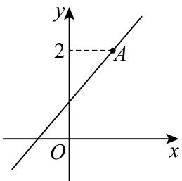
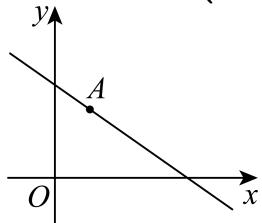

> [!faq]- 2025-2026学年内蒙古包头市包景泰高级中学高二（上）期中数学试卷解析
>
> > [!success]- **【答案】** 详见解析
>
> > [!note]- **【解析】**
> > 详见解析
> >
> > (1) 由 $l: (a - 1)y = (2a - 3)x + 1$ ，即 $a(2x - y) - 3x + y + 1 = 0$ ，则 $\left\{ \begin{array}{l} 2x - y = 0 \\ -3x + y + 1 = 0 \end{array} \right.$ ，解得 $\left\{ \begin{array}{l} x = 1 \\ y = 2 \end{array} \right.$ ，所以直线过定点 $(1, 2)$ .
> >
> > (2)因为直线l不过第四象限，结合图形可知，直线l的斜率存在，所以 $a \neq 1$ ，
> >
> > 此时，直线 $l$ 的方程可化为 $\pmb{y} = \frac{2a - 3}{a - 1}\pmb{x} + \frac{1}{a - 1}$ ，记点 $A(1,2)$ ，则 $k_{OA} = 2$
> >
> > 
> >
> > 由图可得 $0 \leq \frac{2a - 3}{a - 1} \leq 2$ ，解得 $a \geq \frac{3}{2}$ ，因此，实数 $a$ 的取值范围是 $\left[\frac{3}{2}, +\infty\right)$ .
> >
> > (3)已知直线 $l:(a - 1)y = (2a - 3)x + 1$ ，且由题意知 $a\neq 1$
> >
> > 
> >
> > 令 $x = 0$ ，得 $y = \frac{1}{a - 1} >0$ ，得 $a > 1$
> >
> > 令 $y = 0$ ，得 $x = \frac{1}{3 - 2a} >0$ ，得 $a <   \frac{3}{2}$ ，则
> >
> > 则 $S = \frac{1}{2} \times \frac{1}{a - 1} \times \frac{1}{3 - 2a} = \frac{1}{-(a - \frac{5}{4})^2 + \frac{1}{4}}$ ，当 $a = \frac{5}{4}$ 时， $S$ 取最小值，
> >
> > 此时直线l的方程为 $2x+y-4=0$ .
