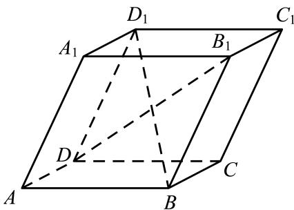
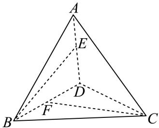

<!-- question-source:start -->
7. 如图所示，四棱柱 $ABCD - A_1B_1C_1D_1$ 中，底面为平行四边形，以顶点 $A$ 为端点的三条棱长都为1，且两两夹角为 $60^{\circ}$ . 设 $\overrightarrow{AB} = \overrightarrow{a}, \overrightarrow{AD} = \overrightarrow{b}, \overrightarrow{AA_1} = \overrightarrow{c}$ ，求 $BD_{1}$ 的长（）

A $\sqrt{2}$ B $\sqrt{3}$ C 2   
D $\sqrt{6}$

如图，四面体 $A - BCD$ ， $\triangle ABD$ 与 $\triangle BCD$ 均为等边三角形，点 $E$ 、 $F$ 分别在边 $AD$ 、 $BD$ ，且满足 $\overrightarrow{BF} = \overrightarrow{FD}$ ， $\sin \angle EBD = \frac{3}{5}$ ，记二面角 $A - BD - C$ 的平面角为 $\theta$ ， $\cos \theta = \frac{1}{3}$ ，则异面直线 $BE$ 与

CF所成角的正弦值是()

$$
\frac {\sqrt {3 5}}{6}
$$

$$
\frac {1}{6}
$$

$$
\frac {2 \sqrt {6}}{5}
$$

$$
\frac {1}{5}
$$
<!-- question-source:end -->

![[Q00092038A1]]
