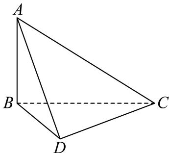

<!-- question-source:start -->
5、《九章算术·商功》中有这样一段话：“斜解立方，得两漿堵。斜解漿堵，其一为阳马，一为鳖臑。”这里所谓的“鳖臑”(biēnào)，就是在对长方体进行分割时所产生的四个面都为直角三角形的三棱锥。已知三棱锥

A - BCD是一个“鳖臑”，AB⊥平面BCD，AC⊥CD且 $AB = \sqrt{2}$ ，BC = CD = 1，则三棱锥A - BCD的外接球的表面积为（）
A 5π
B 4π
C 3π
D 2π

<!-- question-source:end -->

![[Q00091195A1]]
