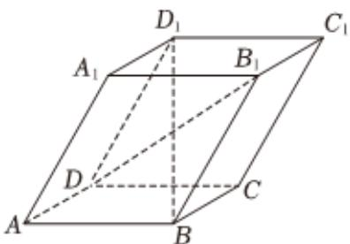
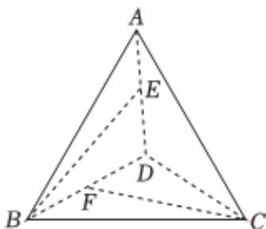

<!-- question-source:start -->
6、如图所示，四棱柱 $ABCD - A_{1}B_{1}C_{1}D_{1}$ 中，底面为平行四边形，以顶点 $\pmb{A}$ 为端点的三条棱长都为1，且两两夹角为 $60^{\circ}$ .设 $\overrightarrow{AB} = \overrightarrow{a},\overrightarrow{AD} = \overrightarrow{b},\overrightarrow{AA_1} = \overrightarrow{c}$ ，求 $BD_{1}$ 的长（）A $\sqrt{2}$ B $\sqrt{3}$ C 2D $\sqrt{6}$

<!-- question-source:end -->

![[Q00091196A1]]
