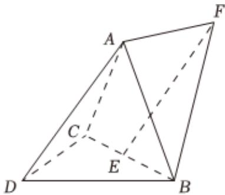

<!-- question-source:start -->
3. 如图，三棱锥 $A - BCD$ 中， $DA = DB = DC$ ， $BD \perp CD$ ， $\angle ADB = \angle ADC = 60^{\circ}$ ， $E$ 为 $BC$ 中点.

1 证明 $BC \perp DA$ ;

2 点 $F$ 满足 $\overrightarrow{EF} = \overrightarrow{DA}$ ，求二面角 $D - AB - F$ 的正弦值.
<!-- question-source:end -->

![[Q00092580A1]]
