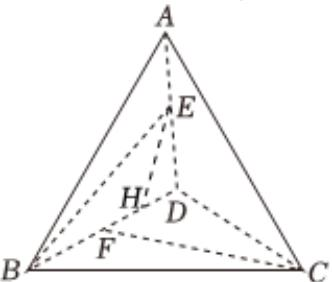

> [!faq]- 2025-2026学年内蒙古包头市景泰高级中学高二（上）月考数学试卷（11月份）解析
>
> > [!success]- **【答案】** C
>
> > [!note]- **【解析】**
> > 由于 $\triangle ABD$ 与 $\triangle BCD$ 均为等边三角形，
> >
> > 由 $\overrightarrow{BF} = \overrightarrow{FD}$ ，可知 $F$ 为 $BD$ 的中点，
> >
> > 过 $E$ 作 $EH \perp BD$ ，交 $BD$ 于 $H$ 点，
> >
> > 
> >
> > 则 $EH\perp BD$ ， $CF\perp BD$ ，
> >
> > 故 $H\acute{E}$ 和 $F\acute{C}$ 的夹角即为二面角A-BD-C的平面角 $\theta$ ，
> >
> > 故 $\cos\langle\overrightarrow{HE},\overrightarrow{FC}\rangle=\frac{1}{3}$
> >
> > 设等边三角形的边长为2，BE与CF的夹角为 $\alpha$ ，则 $\alpha\in[0,\frac{\pi}{2}]$
> >
> > $\overrightarrow{CF} \bullet \overrightarrow{BE} = \overrightarrow{CF} \bullet (\overrightarrow{BH} + \overrightarrow{HE}) = \overrightarrow{CF} \bullet \overrightarrow{HE}$ ,
> >
> > $$
> > \overrightarrow {C F} \bullet \overrightarrow {B E} = | \overrightarrow {C F} | \bullet | \overrightarrow {H E} | c o s (\pi - \theta) = \sqrt {3} \times | \overrightarrow {B E} | s i n \angle E B D \times (- c o s \theta) = | \overrightarrow {C F} | \bullet | \overrightarrow {B E} | c o s (\pi - \theta).
> > $$
> >
> > $$
> > <   \overrightarrow {C F}, \overrightarrow {B E} >
> > $$
> >
> > 则 $\sqrt{3} \times \frac{3}{5} \times (-\frac{1}{3}) = \sqrt{3} cos\langle \overrightarrow{CF}, \overrightarrow{BE} \rangle$ ，即 $-\frac{1}{5} = cos\langle \overrightarrow{CF}, \overrightarrow{BE} \rangle$
> >
> > 所以 $\cos\alpha=|\cos\langle\overrightarrow{CF},\overrightarrow{BE}\rangle|=\frac{1}{5}$ ，即 $\sin\alpha=\frac{2\sqrt{6}}{5}$ .
> >
> > 故选：C.
