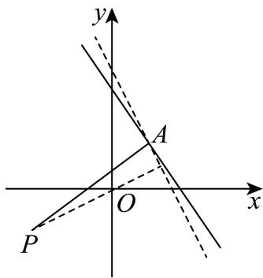

> [!faq]- 2025-2026学年内蒙古包头市景泰高级中学高二（上）月考数学试卷（11月份）解析
>
> > [!success]- **【答案】** C
>
> > [!note]- **【解析】**
> > 将直线 $l:(1 + 3\lambda)x + (1 + \lambda)y - 2 - 4\lambda = 0$ 变形得
> >
> > $$
> > \boldsymbol {x} + \boldsymbol {y} - 2 + \lambda (3 \boldsymbol {x} + \boldsymbol {y} - 4) = 0,
> > $$
> >
> > 由 $\left\{ \begin{array}{l} x + y - 2 = 0 \\ 3x + y - 4 = 0 \end{array} \right.$ ，解得 $\left\{ \begin{array}{l} x = 1 \\ y = 1 \end{array} \right.$ ，所以直线 $l$ 过定点 $A(1,1)$ ，
> >
> > 结合图象可知，点 $P$ 到直线 $l$ 的距离最大为
> >
> > $$
> > | A P | = \sqrt {(- 2 - 1) ^ {2} + (- 1 - 1) ^ {2}} = \sqrt {1 3},
> > $$
> >
> > 此时过点P且垂直于直线l的直线即为直线AP，
> >
> > 所以直线AP的方程为y-1= $\frac{-1-1}{-2-1}(x-1)$ ，即2x-3y+1=0.
> >
> > 
> >
> > 故选：C.
