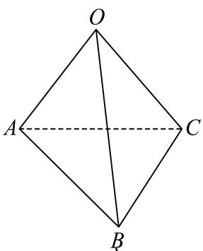

> [!faq]- 2025-2026学年内蒙古包头市景泰高级中学高二（上）月考数学试卷（11月份）解析
>
> > [!success]- **【答案】** ABC
>
> > [!note]- **【解析】**
> > 对于 $\mathbf{A}$ ，由于 $D$ 为 $BC$ 的中点， $\pmb{E}$ 为 $AD$ 的中点，则
> >
> > $$
> > \overrightarrow {O E} = \overrightarrow {O A} + \overrightarrow {A E} = \overrightarrow {O A} + \frac {1}{2} \overrightarrow {A D} = \overrightarrow {O A} + \frac {1}{2} (\frac {1}{2} \overrightarrow {A B} + \frac {1}{2} \overrightarrow {A C}) = \frac {1}{2} \overrightarrow {O A} + \frac {1}{4} \overrightarrow {O B} + \frac {1}{4} \overrightarrow {O C}
> > $$
> >
> > $\mathbf{A}$ 正确；
> >
> > 对于B，因为正四面体OABC，所以对棱互相垂直
> >
> > $$
> > (\overrightarrow {O A} + \overrightarrow {O B}) \cdot (\overrightarrow {C A} + \overrightarrow {C B}) = \overrightarrow {O A} \cdot \overrightarrow {C A} + \overrightarrow {O A} \cdot \overrightarrow {C B} + \overrightarrow {O B} \cdot \overrightarrow {C A} + \overrightarrow {O B} \cdot \overrightarrow {C B} = 1 \times 1 \times \cos
> > $$
> >
> > $$
> > 6 0 ^ {\circ} + 1 \times 1 \times \cos 9 0 ^ {\circ} + 1 \times 1 \times \cos 9 0 ^ {\circ} + 1 \times 1 \times \cos 6 0 ^ {\circ} = 1
> > $$
> >
> > ，故 $B$ 正确；
> >
> > 
> >
> > 对于 $C$ ， $\overrightarrow{AB} = (-1,2,0)$ ， $\overrightarrow{AC} = (1,1,3)$ ，所以向量 $\overrightarrow{AC}$ 在向量 $\overrightarrow{AB}$ 上的投影向量为 $\frac{\overrightarrow{AC}\cdot\overrightarrow{AB}}{|\overrightarrow{AB}|^2}\overrightarrow{AB} = \frac{-1 + 2}{1 + 4}\overrightarrow{AB} = \frac{1}{5}\overrightarrow{AB}$ ，故 $C$ 正确；
> >
> > 对于D，已知 $\overrightarrow{a}=\overrightarrow{OA}-2\overrightarrow{OB}+\overrightarrow{OC},\overrightarrow{b}=-\overrightarrow{OA}+3\overrightarrow{OB}+2\overrightarrow{OC},\overrightarrow{c}=-3\overrightarrow{OA}+7\overrightarrow{OB}$ ，假设向量 $\overrightarrow{a},\overrightarrow{b},\overrightarrow{c}$ 共面，则 $\overrightarrow{a}=x\overrightarrow{b}+y\overrightarrow{c},x,y\in R$ ，
> > 所以 $\overrightarrow{OA}-2\overrightarrow{OB}+\overrightarrow{OC}=x(-\overrightarrow{OA}+3\overrightarrow{OB}+2\overrightarrow{OC})+y(-3\overrightarrow{OA}+7\overrightarrow{OB})$ $=(-x-3y)\overrightarrow{OA}+(3x+7y)\overrightarrow{OB}+2x\overrightarrow{OC}$ 所以 $\left\{\begin{aligned}&1=-x-3y\\&-2=3x+7y\\&1=2x\end{aligned}\right.$ ，解得 $\left\{\begin{aligned}x&=\frac{1}{2}\\ y&=-\frac{1}{2}\end{aligned}\right.$ 所以当 $x=\frac{1}{2},y=-\frac{1}{2}$ 时向量 $\overrightarrow{a},\overrightarrow{b},\overrightarrow{c}$ 共面，故D错误.
> > 故选：ABC.
