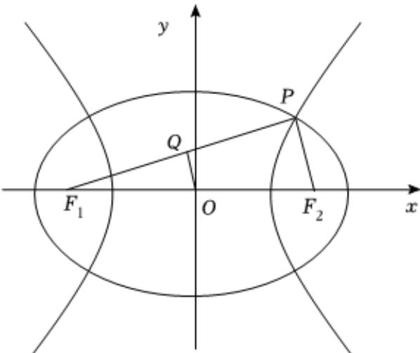

> [!faq]- 2025-2026学年内蒙古包头市景泰高级中学高二（上）月考数学试卷（11月份）解析
>
> > [!success]- **【答案】** $\frac{1+\sqrt{2}}{2}$
>
> > [!note]- **【解析】**
> > 离心率为 $e_{1}$ 的椭圆 $C_{1}:\frac{x^{2}}{a_{1}^{2}}+\frac{y^{2}}{b_{1}^{2}}=1(a_{1}>b_{1}>0)$ 和离心率为 $e_{2}$ 的双曲线 $C_{2}$ ：
> >
> > $\frac{x^2}{a_2^2} - \frac{y^2}{b_2^2} = 1 (a_2 > 0, b_2 > 0)$ 有公共的焦点，
> >
> > 设半焦距为 $c$ ， $\left|PF_1\right| = x$ ， $\left|PF_2\right| = y$
> >
> > $Q$ 为 $PF_{1}$ 中点，线段 $PF_{1}$ 的垂直平分线经过坐标原点， $O$ 为 $F_{1}F_{2}$ 中点，则 $OQ / / PF_{2}$
> >
> > 
> >
> > 由 $OQ \perp PF_{1}, PF_{1} \perp PF_{2}$
> >
> > 则 $x^{2} + y^{2} = 4c^{2}$ ， $x + y = 2a_{1}$ ， $x - y = 2a_{2}$
> >
> > 所以 $(2a_{1})2 + (2a_{2})2 = 2 \times 4c2$ ，从而有 $\frac{1}{e_1^2} + \frac{1}{e_2^2} = 2$
> >
> > 故
> >
> > $$
> > 2 e _ {1} ^ {2} + e _ {2} ^ {2} = \frac {1}{2} (2 e _ {1} ^ {2} + e _ {2} ^ {2}) (\frac {1}{e _ {1} ^ {2}} + \frac {1}{e _ {2} ^ {2}}) = \frac {1}{2} (3 + \frac {2 e _ {1} ^ {2}}{e _ {2} ^ {2}} + \frac {e _ {2} ^ {2}}{e _ {1} ^ {2}}) \geqslant \frac {1}{2} (3 + 2 \sqrt {\frac {2 e _ {1} ^ {2}}{e _ {2} ^ {2}} \cdot \frac {e _ {2} ^ {2}}{e _ {1} ^ {2}}})
> > $$
> >
> > $$
> > = \frac {3 + 2 \sqrt {2}}{2}
> > $$
> >
> > 当且仅当 $\frac{2e_1^2}{e_2^2} = \frac{e_2^2}{e_1^2}$ ，即 $e_2^2 = \sqrt{2} e_1^2 = \frac{1 + \sqrt{2}}{2}$ 时取等号.
> >
> > 故答案为： $\frac{1+\sqrt{2}}{2}$ .
