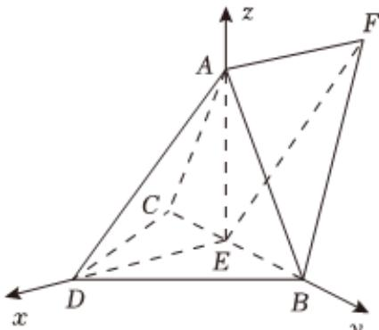

> [!faq]- 2025-2026学年内蒙古包头市景泰高级中学高二（上）月考数学试卷（11月份）解析
>
> > [!success]- **【答案】** 详见解析
>
> > [!note]- **【解析】**
> > 详见解析
> >
> > 证明：(1)连接AE，DE，
> >
> > ∵ DB = DC，E 为 BC 中点.
> >
> > $$
> > \therefore D E \perp B C,
> > $$
> >
> > $$
> > \text {又} \because D A = D B = D C, \angle A D B = \angle A D C = 6 0 ^ {\circ}
> > $$
> >
> > $$
> > \therefore \triangle A C D \text {与} \triangle A B D \text {均为等边三角形，}
> > $$
> >
> > $$
> > \therefore A C = A B,
> > $$
> >
> > $$
> > \therefore A E \perp B C, A E \cap D E = E
> > $$
> >
> > $$
> > \therefore B C \perp \text {平面} A D E,
> > $$
> >
> > $$
> > \because A D \subset \text {平面} A D E,
> > $$
> >
> > $$
> > \therefore B C \perp D A.
> > $$
> >
> > (2)设DA=DB=DC=2，
> >
> > $\therefore BC = 2\sqrt{2}$
> >
> > $\because DE = AE = \sqrt{2},AD = 2,$
> >
> > $$
> > \therefore A E ^ {2} + D E ^ {2} = 4 = A D ^ {2}
> > $$
> >
> > $$
> > \therefore A E \perp D E,
> > $$
> >
> > $$
> > \text {又} \because A E \perp B C, D E \cap B C = E
> > $$
> >
> > ∴ AE⊥平面BCD
> >
> > 以E为原点，建立如图所示空间直角坐标系，
> >
> > 
> >
> > $$
> > D (\sqrt {2}, 0, 0), A (0, 0, \sqrt {2}), B (0, \sqrt {2}, 0), E (0, 0, 0)
> > $$
> >
> > $$
> > \because \overrightarrow {E F} = \overrightarrow {D A}
> > $$
> >
> > $\therefore F(-\sqrt{2},0,\sqrt{2})$ $\therefore \overrightarrow{DA} = (-\sqrt{2},0,\sqrt{2}),\overrightarrow{AB} = (0,\sqrt{2}, - \sqrt{2}),\overrightarrow{AF} = (-\sqrt{2},0,0)$
> >
> > 设平面 $DAB$ 与平面 $ABF$ 的一个法向量分别为 $\overrightarrow{n_1} = (x_1, y_1, z_1), \overrightarrow{n_2} = (x_2, y_2, z_2)$
> >
> > 则 $\left\{ \begin{array}{l} -\sqrt{2} x_1 + \sqrt{2} z_1 = 0 \\ \sqrt{2} y_1 - \sqrt{2} z_1 = 0 \end{array} \right.$ ，令 $x_1 = 1$ ，解得 $y_1 = z_1 = 1$ ，
> >
> > $\left\{ \begin{array}{l} \sqrt{2} y_2 - \sqrt{2} z_2 = 0 \\ -\sqrt{2} x_2 = 0 \end{array} \right.$ ，令 $y_{2} = 1$ ，解得 $x_{2} = 0$ ， $z_{2} = 1$
> >
> > 故 $\overrightarrow{n_1} = (1, 1, 1)$ , $\overrightarrow{n_2} = (0, 1, 1)$ ,
> >
> > 设二面角D-AB-F的平面角为 $\theta$ ，
> >
> > 则 $|\cos \theta | = \frac{|\overrightarrow{n_1} \cdot \overrightarrow{n_2}|}{|\overrightarrow{n_1}| |\overrightarrow{n_2}|} = \frac{2}{\sqrt{3} \times \sqrt{2}} = \frac{\sqrt{6}}{3}$
> >
> > 故 $\sin\theta=\frac{\sqrt{3}}{3}$ ，
> >
> > 所以二面角 $D - AB - F$ 的正弦值为 $\frac{\sqrt{3}}{3}$ .
