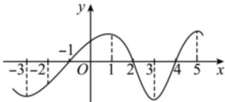

<!-- question-source:start -->
3、如图是函数 $y=f(x)$ ， $x\in[-3,5]$ 的导函数 $f'(x)$ 的图象， $f(-3)<0$ ，则下列判断正确的是（）
A $f(x)$ 单调递增区间为 $[-1,2]$ ， $[4,5]$ B $f'(2)=0$ C $f(x) \leqslant f(2)$ D $f(2) > f(4)$

<!-- question-source:end -->

![[Q00091182A1]]
