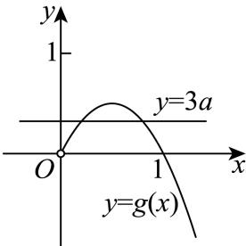

> [!faq]- 2025-2026学年内蒙古包头市经纬中学高二（下）月考数学试卷（4月份）解析
>
> > [!success]- **【答案】** B
>
> > [!note]- **【解析】**
> > 由已知可得 $f'(x) = 2x - 2 + \frac{3a}{x}$ ，
> >
> > 由 $f'(x) = 0 (x > 0)$ ，可得 $3a = -2x^2 + 2x = -2(x - \frac{1}{2})^2 + \frac{1}{2}$
> >
> > 当 $0 < x < \frac{1}{2}$ 时，函数 $g(x) = -2\left(x - \frac{1}{2}\right)^2 + \frac{1}{2}$ 单调递增，在 $x > \frac{1}{2}$ 时，该函数单调递减，
> >
> > 所以当 $x = \frac{1}{2}$ 时，函数 $g(x) = -2\left(x - \frac{1}{2}\right)^2 + \frac{1}{2}$ 有最大值 $\frac{1}{2}$ ，且 $g(0) = g(1) = 0$
> >
> > 所以当 $x > 0$ 时， $f(x) = x^2 - 2x + a\ln x$ 有两个不同的极值点，
> >
> > 等价于直线 $y = 3a$ 与函数 $g(x) = -2(x - \frac{1}{2})^2 +\frac{1}{2}$ 有两个不同的交点，如图，
> >
> > 
> >
> > 所以 $3a\in(0,\frac{1}{2})$ ，即 $a\in(0,\frac{1}{6})$ .
> >
> > 故选：B.
