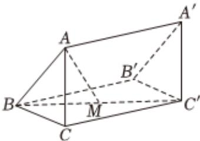

<!-- question-source:start -->
2、已知数列 $\{a_{n}\}$ 的首项为 $a_{1}=2$ ，且 $a_{n}=1-\frac{1}{a_{n-1}}(n\geqslant2)$ ，则 $a_{7}=(\quad)$ A -1
B $-\frac{1}{2}$ C $\frac{1}{2}$ D 2

<!-- question-source:end -->

![[Q00092582A1]]
