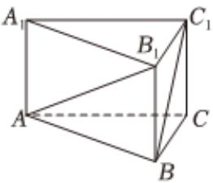

<!-- question-source:start -->
4、对称轴都在坐标轴上的等轴双曲线经过点 $(2, -2\sqrt{2})$ ，则双曲线的标准方程为（）A $\frac{y^2}{8} - \frac{x^2}{2} = 1$

B $\frac{x^3}{2} -\frac{y^3}{8} = 1$ C $\frac{y^2}{4} -\frac{x^2}{4} = 1$ D $\frac{x^2}{4} -\frac{y^2}{4} = 1$

<!-- question-source:end -->

![[Q00092584A1]]
