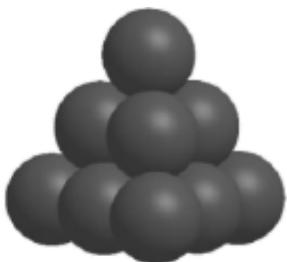

<!-- question-source:start -->
7、若圆 $(x-a)^{2}+(y-a)^{2}=4(a\in R)$ 上到直线 $x+y=0$ 的距离为1的点恰有三个，则a的值为（）
A $\pm3$ B $\pm\sqrt{2}$ C $\pm1$

D ± $\frac{\sqrt{2}}{2}$

<!-- question-source:end -->

![[Q00092587A1]]
