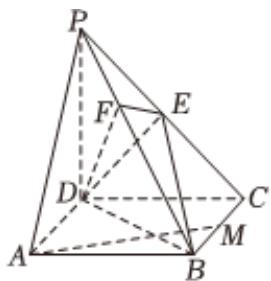

<!-- question-source:start -->
3、如图，在四棱锥P-ABCD中，底面ABCD是矩形，侧棱PD⊥底面ABCD，PD=DC=1，AD= $\sqrt{2}$ ，E是PC的中点，M是BC的中点，作EF⊥PB交PB于点F.

(1)求证： $PB \perp$ 平面EFD；

(2)求证：AM//平面EFD；

(3)求平面 $EFD$ 与平面 $EBD$ 的夹角的正弦值.

<!-- question-source:end -->

![[Q00092597A1]]
