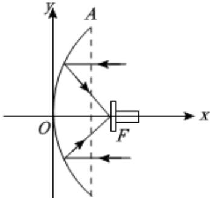

> [!faq]- 2025-2026学年内蒙古包头市高二（上）期末数学试卷解析
>
> > [!success]- **【答案】** B
>
> > [!note]- **【解析】**
> > 根据题意可建系如图：
> >
> > 
> >
> > 设抛物线方程为 $y^{2}=2px,p>0$
> >
> > 则根据题意可得 $A(1,3)$ 在抛物线上，
> >
> > 所以9 = 2p，所以 $p = \frac{9}{2}$ ，
> >
> > 所以抛物线方程为 $y^{2}=9x$ ，
> >
> > 所以抛物线的焦点F到顶点的距离为 $\frac{p}{2}=\frac{9}{4}$ .
> >
> > 故选：B.
